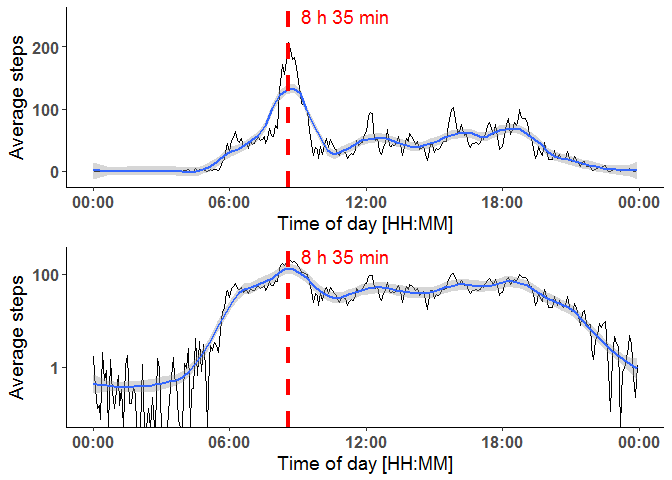

# Reproducible Research: Peer Assessment 1

date: 2017, June 9th

### Introduction

This assignment makes use of data from a personal activity monitoring device. This device collects data at 5 minute intervals throughout the day. The data consists of two months of data from an anonymous individual collected during the months of October and November, 2012 and include the number of steps taken in 5 minute intervals each day.

This document performs some rudimentary data analysis, including the investigation of
daily patterns and differences between workdays and weekends.


First, let's include some useful libraries:


```r
library(ggplot2)
library(grid)
library(gridExtra)
library(plyr)
library(dplyr)
library(magrittr)
library(reshape2)
```


### Loading and preprocessing the data

Set working directory if necessary, unzip and read the file "activity.csv". Format the date column.


```r
#setwd("C:/Users/YourWD")
unzip("activity.zip")
data<-read.csv(file="./activity.csv", header = TRUE, na.strings = "NA", stringsAsFactors = FALSE)
data$date=as.POSIXct(data$date, format="%Y-%m-%d")
```

### What is mean total number of steps taken per day?

For this section, we remove rows with *NA* steps. In addition, we remove all days which
have a total of zero steps, as this indicates that the movement was not tracked at all
rather than that the subject was immobile for 24 hours. 


```r
df.daily<-ddply(data, .(date), summarize, totalSteps=sum(steps, na.rm=TRUE))%>%
        subset(totalSteps>0)
```

We define some general settings for the plot layout (*mytheme*) and plot the histogram
of the total number of steps per day:


```r
mytheme<-theme_classic()+theme(plot.title = element_text(size=16, hjust = 0.5,face="bold"), 
                axis.text=element_text(size=12, face="bold"),axis.title=element_text(size=14),
               legend.text=element_text(size=12))

ggplot(df.daily, aes(totalSteps))+
        geom_histogram(binwidth = 2000, color="black", lwd=1.5,fill="white" )+mytheme+
        labs(x="Steps per day", y="Occurence")
```

<!-- -->

Now on to calculate the mean and median value of the total steps taken per day


```r
mean(df.daily$totalSteps)%>%round(digits=0)
```

```
## [1] 10766
```

```r
median(df.daily$totalSteps)%>%round(digits=0)
```

```
## [1] 10765
```

In this case, mean and median value are essentially identical. For sake of completeness,
let's also calculate the mean and median values, if the days without tracking would not have been removed:


```r
df.daily2<-ddply(data, .(date), summarize, totalSteps=sum(steps, na.rm=TRUE))
mean(df.daily2$totalSteps)%>%round(digits=0)
```

```
## [1] 9354
```

```r
median(df.daily2$totalSteps)%>%round(digits=0)
```

```
## [1] 10395
```

Unsurprisingly, these numbers are quite a bit lower.

### What is the average daily activity pattern?

For now, we still ignore the *NA* observations. We calculate the mean activity per 
interval and find the interval with the highest average activity:


```r
df.int<-ddply(data, .(interval), summarize, MperInt=mean(steps, na.rm=TRUE))
tmax<-df.int[which(df.int$MperInt==max(df.int$MperInt)),]$interval
mins=tmax%%60
hours=tmax%/%60
paste(hours, "h", mins, "min", sep=" ")
```

```
## [1] "13 h 55 min"
```

The interval of highest activity was typically 13:55-14:00. Now we plot the full
daily pattern on linear and logarithmic scale together with a *loess* smoothing
function.


```r
p0<-ggplot(df.int, aes(interval, MperInt))+geom_line()+ mytheme+
        labs(x="Time of day [min]", y="Average steps")+
        geom_smooth(method="loess", span=0.2, na.rm=TRUE)+
        geom_vline(aes(xintercept=tmax), color="red", lwd=1.5, lty="dashed")+
        annotate("text", x=tmax, y=250,hjust=-0.15,color="red", size=5,
                 label=paste(hours, "h", mins, "min", sep=" "))
p1<-p0+scale_y_log10()
grid.arrange(p0, p1, ncol=1)
```

<!-- -->


### Imputing missing values

Now we want to impute the missing observations of step counts. Let's first check what
fraction of observations is missing:


```r
sum(is.na(data$steps))/dim(data)[1]
```

```
## [1] 0.1311475
```

13% of the observations are missing and we will do our best to replace all *NA*s
with reasonable numbers. In this case, we try to use the *loess* regression
from the plot above:


```r
imp<-predict(loess(MperInt~interval, df.int, span=0.2, na.rm=TRUE), df.int$interval)
imptable<-as.data.frame(cbind(interval=df.int$interval, imp=imp))
data.imp<-merge(data, imptable, by="interval")
data.imp[which(is.na(data.imp$steps)),]$steps<-data.imp[which(is.na(data.imp$steps)),"imp"]
```

Now rearrange the columns to obtain a new dataset that is equal to the original dataset
but with the missing data filled in.


```r
data.imp<-data.imp[,c("steps", "date", "interval")]
```

Now we re-plot the histogram of total number of steps per day:


```r
df.daily.imp<-ddply(data.imp, .(date), summarize, totalSteps=sum(steps, na.rm=TRUE))
ggplot(df.daily.imp, aes(totalSteps))+
        geom_histogram(binwidth = 2000, color="black", lwd=1.5,fill="white" )+mytheme+
        labs(x="Steps per day", y="Occurence")
```

<!-- -->

Including the imputed data, the mean and median steps per day are


```r
mean(df.daily.imp$totalSteps)%>%round(digits=0)
```

```
## [1] 10750
```

```r
median(df.daily.imp$totalSteps)%>%round(digits=0)
```

```
## [1] 10640
```

For reference, we also calculate the total number of steps for the function we used
to impute the missing values:


```r
sum(imp)%>%round(digits=0)
```

```
## [1] 10640
```

As expected, the new average and median value trend towards the result of the imputing
function. Since 13% of the whole data set are imputed by "representative" data, the median
result is even identical to the data used for imputation.

Compared to the inital results (days with 0 steps removed) the new average
and median are slightly lower.

### Are there differences in activity patterns between weekdays and weekends?

For this question, we continue to use the data set with imputed missing values.
First, we identify the weekday from the *date* column and - based on this result -
define a new column *cat*, which categorizes each date into *weekday* or *weekend*.


```r
data.imp$weekday<-as.character(weekdays(data.imp$date))
data.imp$cat<-ifelse(data.imp$weekday %in% c("Sunday", "Saturday"), "weekend", "weekday")
```

Next, we determine the mean step count for each interval based on *cat* and plot
the daily activit patterns separately for workdays and weekends:


```r
df.int.imp<-ddply(data.imp, .(cat,interval), summarize, MperInt=mean(steps, na.rm=TRUE))

ggplot(df.int.imp, aes(interval, MperInt))+geom_line()+ mytheme+facet_grid(cat~.)+
       labs(x="Time of day [min]", y="Average steps per 5 min")+
        geom_hline(yintercept=0)+geom_smooth(method="loess", span=0.2, na.rm=TRUE)
```

<!-- -->

Finally, we take a look at the difference between the activity patterns between both categories
in order to better identify the times of day, where the major differences can be observed:


```r
final<-dcast(df.int.imp, interval~cat)
final$diff<-final$weekend-final$weekday
ggplot(final, aes(interval, diff))+geom_line()+ mytheme+
        labs(x="Time of day [min]", y="Difference of steps per 5 min")+
        geom_hline(yintercept=0)+geom_smooth(method="loess", span=0.2, na.rm=TRUE)+
        ggtitle(label="weekend minus weekday activity profile")
```

<!-- -->

Hope you enjoyed reading! 
